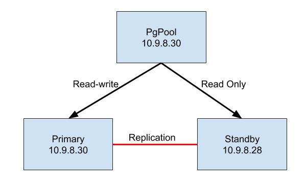
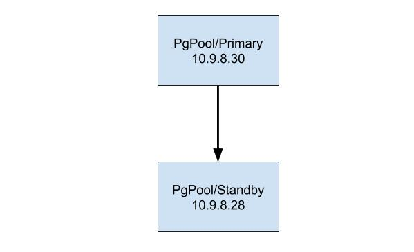

# Architecture

## Step 1. Install PostgresSQL server on two servers
```sh
sudo apt-get --purge remove postgresql-*
sudo rm -Rf /etc/postgresql /var/lib/postgresql

sudo apt update
sudo apt -y install vim bash-completion wget
sudo apt -y upgrade
wget --quiet -O - https://www.postgresql.org/media/keys/ACCC4CF8.asc | sudo apt-key add -
echo "deb http://apt.postgresql.org/pub/repos/apt/ `lsb_release -cs`-pgdg main" |sudo tee  /etc/apt/sources.list.d/pgdg.list
sudo apt update
sudo apt -y install postgresql-12 postgresql-client-12

sudo su - postgres
psql -c "alter user postgres with password 'secret'"
psql
```

## Step 2. Install RepMgr on two servers
```sh
echo 'PGPOOL_HOST=10.9.8.30' >> ~/.bashrc
echo 'PGPOOL_MASTER=10.9.8.30' >> ~/.bashrc
echo 'PGPOOL_STANDBY=10.9.8.28' >> ~/.bashrc
source ~/.bashrc
curl https://dl.2ndquadrant.com/default/release/get/deb | sudo bash
sudo apt-get install postgresql-12-repmgr
```

## Step 3. Create repmgr database on two servers
```sh
sudo -i -u postgres
createuser --replication --createdb --createrole --superuser repmgr
psql -c 'ALTER USER repmgr SET search_path TO repmgr_test, "$user", public;'
createdb repmgr --owner=repmgr
```
## Step 4. Setup SSH key on two servers
```sh
sudo -i -u postgres
ssh-keygen
# Copy ssh keys to other servers
ssh-copy-id root@${PGPOOL_MASTER}
ssh-copy-id root@${PGPOOL_STANDBY}
```
## Step 5. Config postgres server

```
# Edit file /etc/postgresql/12/main/postgresql.conf
listen_addresses = '*'
shared_preload_libraries = 'repmgr'
wal_level = replica
max_wal_senders = 5
wal_keep_segments = 64
max_replication_slots = 5
hot_standby = on
wal_log_hints = on
```
## Step 6. Edit  sudo vi /etc/postgresql/12/main/pg_hba.conf on Master Node
```sh
host    all                postgres        10.9.8.30/32     trust
host    all                postgres        10.9.8.28/32     trust

host    repmgr             repmgr          10.9.8.30/32     trust
host    repmgr             repmgr          10.9.8.28/32     trust

host    replication        repmgr          10.9.8.30/32     trust
host    replication        repmgr          10.9.8.28/32     trust

host    all                postgres        10.9.8.30/32    trust
```
## Step 7. Edit  sudo vi /etc/postgresql/12/main/pg_hba.conf on Standby Node
```sh
host    all                postgres        10.9.8.30/32     trust
host    all                postgres        10.9.8.28/32     trust

host    repmgr             repmgr          10.9.8.30/32     trust
host    repmgr             repmgr          10.9.8.28/32     trust

host    replication        repmgr          10.9.8.30/32     trust
host    replication        repmgr          10.9.8.28/32     trust

host    all                postgres        10.9.8.30/32    trust
```

## Step 8. Test DB
```sh
# On Primary
sudo su postgres
psql 'host=10.9.8.28 dbname=repmgr user=repmgr'

# On Standby
sudo su postgres
psql 'host=10.9.8.30 dbname=repmgr user=repmgr'

```
## View LOG
```sh
vim /var/log/postgres/postgresql-%d-main.log
```
## Step 9. Create file  etc/repmgr.conf on PRIMARY Node
```sh
cat > /etc/repmgr.conf << EOF
node_id = 1
node_name = 'node1'
conninfo = 'host=10.9.8.30 user=repmgr dbname=repmgr'
data_directory = '/var/lib/postgresql/12/main'
use_replication_slots = yes
reconnect_attempts = 5
reconnect_interval = 1
failover = manual
pg_bindir = '/usr/lib/postgresql/12/bin'
promote_command = 'repmgr standby promote -f /etc/repmgr.conf'
follow_command = 'repmgr standby follow -f /etc/repmgr.conf'
log_level = INFO
log_file = '/var/log/postgresql/repmgr.log'
EOF
```
##  Step 10. Create file  etc/repmgr.conf on STANDY Node
```sh
cat > /etc/repmgr.conf <<EOF
node_id = 1
node_name = 'node1'
conninfo = 'host=10.9.8.28 user=repmgr dbname=repmgr'
data_directory = '/var/lib/postgresql/12/main'
use_replication_slots = yes
reconnect_attempts = 5
reconnect_interval = 1
failover = manual
pg_bindir = '/usr/lib/postgresql/12/bin'
promote_command = 'repmgr standby promote -f /etc/repmgr.conf'
follow_command = 'repmgr standby follow -f /etc/repmgr.conf'
log_level = INFO
log_file = '/var/log/postgresql/repmgr.log'
EOF
```
## Step 11. Register PRIMARY and STANDBY node
### On PRIMARY node
```sh
sudo su postgres
repmgr primary register
```
### On STANDBY node.
```sh
export PRIMARY_HOST = 10.9.8.30
sudo service postgresql stop
sudo su postgres
rm -rf /var/lib/postgresql/12/main
repmgr -h ${PRIMARY_HOST} -U repmgr -d repmgr  -f /etc/repmgr.conf standby clone
exit
sudo service postgresql start
sudo su postgres
repmgr -f /etc/repmgr.conf standby register
PRIMARY_HOST
```

## Test RepMgr
```
repmgr cluster show
```
### Result
```
 node_id | hostname  | port | status | lb_weight |  role   | select_cnt | load_balance_node | replication_delay | replication_state | replicat
ion_sync_state | last_status_change  
---------+-----------+------+--------+-----------+---------+------------+-------------------+-------------------+-------------------+---------
---------------+---------------------
 0       | 10.9.8.30 | 5432 | up     | 0.500000  | primary | 1534       | true              | 0                 |                   |         
               | 2020-08-01 05:51:45
 1       | 10.9.8.28 | 5432 | up   | 0.500000  | standby | 208        | false             | 0                 |                   |         
               | 2020-08-01 05:51:45
```

## Step 12. Install PgPool
```sh
#Install pgpool2
sudo apt-get install pgpool2
#Install pgpool extensions
sudo apt-get install postgresql-12-pgpool2
```
## Step 13. Create failover command. It is executed when any node down
```sh
cat >/etc/pgpool2/failover.sh <<EOF
#!/bin/bash

LOGFILE=/var/log/pgpool/failover.log
if [ ! -f $LOGFILE ] ; then
 > $LOGFILE
fi
PGVER=${PGVER:-12}
echo $@

# Special values:
#   %d = node id
#   %h = host name
#   %p = port number
#   %D = database cluster path
#   %m = new master node id
#   %H = hostname of the new master node
#   %M = old master node id
#   %P = old primary node id
#   %r = new master port number
#   %R = new master database cluster path


FALLING_NODE=$1            # %d
FALLING_HOST=$2            # %h
FALLING_PORT_NUMBER=$3     # %p
FALLING_CLUSTER_PATH=$4    # %D
NEW_MASTER_ID=$5           # %m
NEW_HOST=$6                # %H
OLD_MASTER_ID=$7           # %M
OLD_PRIMARY_ID=$8          # %P
NEW_PORT=$9                # %r
NEW_CLUSTER_PATH=$10       # %R

(
date
echo "FALLING_NODE: $FALLING_NODE"
echo "FALLING_HOST: $FALLING_HOST"
echo "FALLING_PORT_NUMBER: $FALLING_PORT_NUMBER"
echo "FALLING_CLUSTER_PATH: $FALLING_CLUSTER_PATH"
echo "NEW_MASTER_ID: $NEW_MASTER_ID"
echo "NEW_HOST: $NEW_HOST"
echo "OLD_MASTER_ID: $OLD_MASTER_ID"
echo "OLD_PRIMARY_ID: $OLD_PRIMARY_ID"
echo "NEW_PORT: $NEW_PORT"
echo "NEW_CLUSTER_PATH: $NEW_CLUSTER_PATH"

#ssh_options="ssh -p 22 -n -T -o UserKnownHostsFile=/dev/null -o StrictHostKeyChecking=no"
set -x

ssh root@${NEW_HOST} "sudo -u postgres /usr/lib/postgresql/12/bin/repmgr --log-to-file -f /etc/repmgr.conf standby promote -v"

# if [ $FALLING_NODE = $OLD_PRIMARY_ID ] ; then
#   ssh root@${NEW_HOST} "sudo -u postgres /usr/lib/postgresql/12/bin/repmgr --log-to-file -f /etc/repmgr.conf standby promote -v"
# else
#   echo old primary id is $OLD_PRIMARY_ID and falling node is $FALLING_NODE
# fi
exit 0;
) 2>&1 | tee -a ${LOGFILE}
EOF

sudo chown -R postgres:postgres /opt/pgpool2/failover.sh
```

## Step 14. Config pgpool
```sh
cat > /etc/pgpool2/pgpool.conf <<EOF
log_destination = 'syslog'

log_line_prefix = '%t: pid %p: '   # printf-style string to output at beginning of each log line.
log_connections = on
log_hostname = on
log_statement = on                            # Log all statements
log_per_node_statement = on

log_standby_delay = 'always'

syslog_facility = 'LOCAL0'
syslog_ident = 'pgpool'
log_error_verbosity = default          # terse, default, or verbose messages
client_min_messages = error
log_min_messages = info

logdir = '/var/log'

listen_addresses = '*'
port = 5433

backend_hostname0 = '10.9.8.30'
backend_port0 = 5432
backend_weight0 = 1
backend_data_directory0 = '/var/lib/postgresql/12/main/'
backend_flag0 = 'ALLOW_TO_FAILOVER'
backend_application_name0 = 'node1'

backend_hostname1 = '10.9.8.28'
backend_port1 = 5432
backend_weight1 = 1
backend_data_directory1 = '/var/lib/postgresql/12/main/'
backend_flag1 = 'ALLOW_TO_FAILOVER'
backend_application_name1 = 'node2'

connection_cache = on
load_balance_mode = on
enable_pool_hba = on

master_slave_mode = on
master_slave_sub_mode = 'stream'
sr_check_period = 10
sr_check_user = 'repmgr'
sr_check_database = 'repmgr'
delay_threshold = 10000000

health_check_period = 10
health_check_timeout = 20
health_check_user = 'postgres'
health_check_password = ''
health_check_database = 'postgres'
health_check_max_retries = 3
health_check_retry_delay = 10
connect_timeout = 10000

failover_command = '/etc/pgpool2/failover.sh  %d %h %p %D %m %H %M %P %r %R'
failover_on_backend_error = off
auto_failback = on

# recovery_user = 'postgres'

#use_watchdog = on
#wd_hostname = '10.9.8.30'
#wd_port = 9999

#wd_heartbeat_port = 9694
#heartbeat_destination0 = '10.9.8.28'

#other_pgpool_hostname0 = '10.9.8.28'
#other_pgpool_port0 = 5433
#other_wd_port0 = 9999

EOF
```

## Step 15. Create Pgpool user and Pgpool database.
```sh
sudo su postgres
psql 
create user pgpool;
create database pgpool;
GRANT ALL PRIVILEGES ON DATABASE "pgpool" to pgpool;
GRANT pg_monitor TO pgpool;
GRANT pg_monitor TO repmgr;

```
## Step 16. Edit /etc/postgresql/12/main/pg_hba.conf
```sh
sudo vi /etc/postgresql/12/main/pg_hba.conf
host    pgpool             pgpool          10.9.8.30/32    trust
# host    all             pgpool          10.9.8.30/32    trust
```

## Step 17. Restart all nodes
```sh
sudo service postgresql restart

sudo service pgpool2 restart
```

# Setup PGpool With Watchdog
 
</br>
Do step 1 to step 13 on all of nodes

## Step 14. Config pgpool on PRIMARY Noe
```sh
cat > /etc/pgpool2/pgpool.conf << EOF
log_destination = 'syslog'

log_line_prefix = '%t: pid %p: '   
log_connections = on
log_hostname = on
log_statement = on                          
log_per_node_statement = on

log_standby_delay = 'always'

syslog_facility = 'LOCAL0'
syslog_ident = 'pgpool'
log_error_verbosity = default        
client_min_messages = error
log_min_messages = info

logdir = '/var/log'

listen_addresses = '*'
port = 5433

backend_hostname0 = '10.9.8.30'
backend_port0 = 5432
backend_weight0 = 1
backend_data_directory0 = '/var/lib/postgresql/12/main/'
backend_flag0 = 'ALLOW_TO_FAILOVER'
backend_application_name0 = 'node1'

backend_hostname1 = '10.9.8.28'
backend_port1 = 5432
backend_weight1 = 1
backend_data_directory1 = '/var/lib/postgresql/12/main/'
backend_flag1 = 'ALLOW_TO_FAILOVER'
backend_application_name1 = 'node2'


connection_cache = on
load_balance_mode = on
enable_pool_hba = on

master_slave_mode = on
master_slave_sub_mode = 'stream'
sr_check_period = 10
sr_check_user = 'repmgr'
sr_check_database = 'repmgr'
delay_threshold = 10000000

health_check_period = 10
health_check_timeout = 20
health_check_user = 'postgres'
health_check_password = ''
health_check_database = 'postgres'
health_check_max_retries = 3
health_check_retry_delay = 10
connect_timeout = 10000

failover_command = '/etc/pgpool2/failover.sh  %d %h %p %D %m %H %M %P %r %R'
failover_on_backend_error = off
auto_failback = on

use_watchdog = on
wd_hostname = '10.9.8.30'
wd_port = 9999

wd_heartbeat_port = 9694
heartbeat_destination0 = '10.9.8.28'

other_pgpool_hostname0 = '10.9.8.28'
other_pgpool_port0 = 5433
other_wd_port0 = 9999

EOF
```
## Step 15. Config pgpool on STANDBY Noe
```sh
cat > /etc/pgpool2/pgpool.conf <<EOF

log_destination = 'syslog'

log_line_prefix = '%t: pid %p: '   
log_connections = on
log_hostname = on
log_statement = on                          
log_per_node_statement = on

log_standby_delay = 'always'

syslog_facility = 'LOCAL0'
syslog_ident = 'pgpool'
log_error_verbosity = default        
client_min_messages = error
log_min_messages = info

logdir = '/var/log'

listen_addresses = '*'
port = 5433

backend_hostname0 = '10.9.8.30'
backend_port0 = 5432
backend_weight0 = 1
backend_data_directory0 = '/var/lib/postgresql/12/main/'
backend_flag0 = 'ALLOW_TO_FAILOVER'
backend_application_name0 = 'node1'

backend_hostname1 = '10.9.8.28'
backend_port1 = 5432
backend_weight1 = 1
backend_data_directory1 = '/var/lib/postgresql/12/main/'
backend_flag1 = 'ALLOW_TO_FAILOVER'
backend_application_name1 = 'node2'


connection_cache = on
load_balance_mode = on
enable_pool_hba = on

master_slave_mode = on
master_slave_sub_mode = 'stream'
sr_check_period = 10
sr_check_user = 'repmgr'
sr_check_database = 'repmgr'
delay_threshold = 10000000

health_check_period = 10
health_check_timeout = 20
health_check_user = 'postgres'
health_check_password = ''
health_check_database = 'postgres'
health_check_max_retries = 3
health_check_retry_delay = 10
connect_timeout = 10000

failover_command = '/etc/pgpool2/failover.sh  %d %h %p %D %m %H %M %P %r %R'
failover_on_backend_error = off
auto_failback = on

use_watchdog = on
wd_hostname = '10.9.8.28'
wd_port = 9999

wd_heartbeat_port = 9694
heartbeat_destination0 = '10.9.8.30'

other_pgpool_hostname0 = '10.9.8.30'
other_pgpool_port0 = 5433
other_wd_port0 = 9999

EOF
``` 

## Step 16. Create Pgpool user and Pgpool database.
```sh
sudo su postgres
psql 
create user pgpool;
create database pgpool;
GRANT ALL PRIVILEGES ON DATABASE "pgpool" to pgpool;
GRANT pg_monitor TO pgpool;
GRANT pg_monitor TO repmgr;

```
## Step 17. Edit /etc/postgresql/12/main/pg_hba.conf
```sh
sudo vi /etc/postgresql/12/main/pg_hba.conf
host    pgpool             pgpool          10.9.8.30/32    trust
# host    all             pgpool          10.9.8.30/32    trust
```

## Step 18. Restart all nodes
```sh
sudo service posgressql restart

sudo service pgpool2 restart
```

## Check pgpool
```sh
sudo su postgres

psql -h 10.9.8.30 -p 5433 -U pgpool

show pool_nodes;

```
### Failback
What happens if the previous primary node comes back online?
We have to manually attach the old primary as new standby. Run the following commands:

```sh
sudo service postgresql stop
sudo su postgres
rm -rf /var/lib/postgresql/12/main
repmgr -h 10.9.8.28 -U repmgr -d repmgr  -f /etc/repmgr.conf standby clone
exit
sudo service postgresql start
sudo su postgres
repmgr -f /etc/repmgr.conf standby register
```


